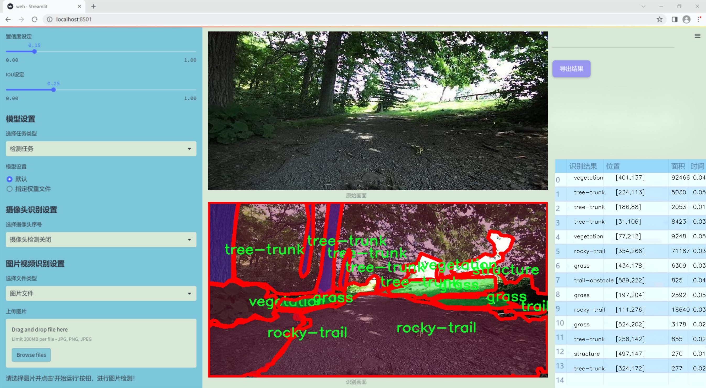
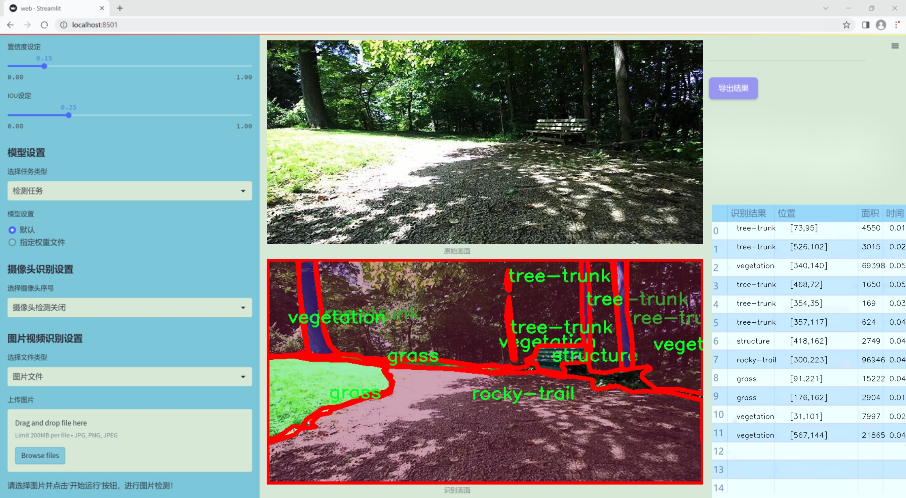
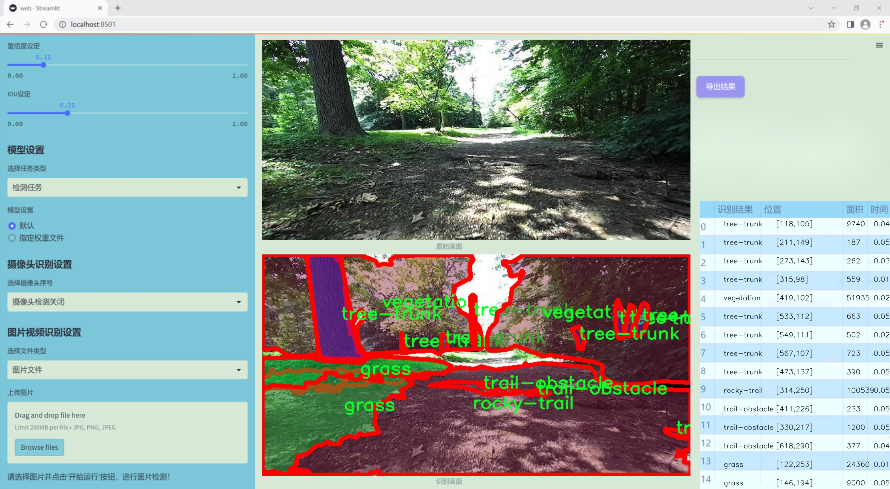
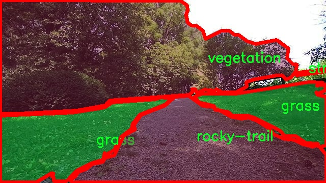
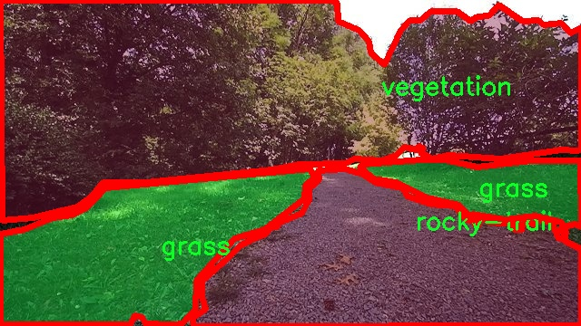
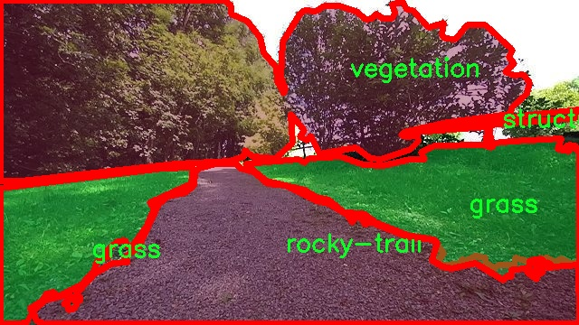
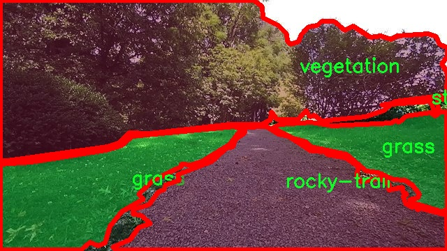

### 1.背景意义

研究背景与意义

随着全球城市化进程的加快，乡村地区的生态环境和交通安全问题日益凸显。乡村道路作为连接城乡的重要通道，其安全性和通行能力直接影响到农村经济的发展和居民的生活质量。因此，开发高效的道路监测与管理系统显得尤为重要。近年来，计算机视觉技术的快速发展为乡村道路的植物与障碍物识别提供了新的解决方案。尤其是基于深度学习的图像分割技术，能够在复杂环境中实现高精度的目标检测与识别。

本研究旨在基于改进的YOLOv11模型，构建一个专门针对乡村道路植物与障碍物的识别图像分割系统。该系统将利用一个包含1300张图像的数据集，涵盖草地、岩石小径、粗糙小径、结构物、道路障碍物、树干和植被等七个类别。这些类别的选择不仅反映了乡村道路环境的多样性，也为系统的实际应用提供了丰富的场景支持。通过对这些图像的深度学习训练，系统将能够有效识别和分割出不同类型的植物与障碍物，从而为乡村道路的管理和维护提供科学依据。

此外，乡村道路的植物与障碍物识别系统的建立，能够为生态保护、交通安全、灾害预警等方面提供重要的数据支持。通过实时监测和分析道路环境，能够及时发现潜在的安全隐患，减少交通事故的发生。同时，该系统的应用还可以为乡村环境的可持续发展提供技术保障，促进人与自然的和谐共生。因此，本研究不仅具有重要的学术价值，也具有广泛的社会应用前景。

### 2.视频效果

[2.1 视频效果](https://www.bilibili.com/video/BV16NqVYqE39/)

### 3.图片效果







##### [项目涉及的源码数据来源链接](https://kdocs.cn/l/cszuIiCKVNis)**

注意：本项目提供训练的数据集和训练教程,由于版本持续更新,暂不提供权重文件（best.pt）,请按照6.训练教程进行训练后实现上图演示的效果。

### 4.数据集信息

##### 4.1 本项目数据集类别数＆类别名

nc: 7
names: ['grass', 'rocky-trail', 'rough-trail', 'structure', 'trail-obstacle', 'tree-trunk', 'vegetation']


该项目为【图像分割】数据集，请在【训练教程和Web端加载模型教程（第三步）】这一步的时候按照【图像分割】部分的教程来训练

##### 4.2 本项目数据集信息介绍

本项目数据集信息介绍

本项目旨在改进YOLOv11模型，以实现对乡村道路植物与障碍物的高效识别与图像分割。为此，我们构建了一个专门的数据集，主题为“Arboretum Less classes”，该数据集包含七个类别，涵盖了乡村道路环境中常见的植物与障碍物。这七个类别分别为：草地（grass）、岩石小径（rocky-trail）、粗糙小径（rough-trail）、结构物（structure）、小径障碍物（trail-obstacle）、树干（tree-trunk）以及植被（vegetation）。这些类别的选择不仅考虑了乡村道路的自然环境特征，还兼顾了可能影响行车安全和行人通行的障碍物。

数据集的构建过程注重多样性与代表性，确保每个类别的样本数量均衡且具备一定的复杂性，以便于模型在训练过程中能够学习到丰富的特征。图像数据来源于多个乡村道路场景，涵盖不同的季节和天气条件，从而增强模型的泛化能力。每张图像都经过精确标注，确保每个类别的物体都被准确地框定与分割。这种细致的标注不仅提高了数据集的质量，也为后续的模型训练提供了坚实的基础。

在数据集的使用过程中，我们将重点关注模型在识别和分割不同类别物体时的表现，特别是在复杂背景和遮挡情况下的鲁棒性。通过对这些类别的深入分析与学习，我们期望能够提升YOLOv11在乡村道路场景中的应用效果，进而为智能交通系统的建设提供更为精准的技术支持。










### 5.全套项目环境部署视频教程（零基础手把手教学）

[5.1 所需软件PyCharm和Anaconda安装教程（第一步）](https://www.bilibili.com/video/BV1BoC1YCEKi/?spm_id_from=333.999.0.0&vd_source=bc9aec86d164b67a7004b996143742dc)


[5.2 安装Python虚拟环境创建和依赖库安装视频教程（第二步）](https://www.bilibili.com/video/BV1ZoC1YCEBw?spm_id_from=333.788.videopod.sections&vd_source=bc9aec86d164b67a7004b996143742dc)

### 6.改进YOLOv11训练教程和Web_UI前端加载模型教程（零基础手把手教学）

[6.1 改进YOLOv11训练教程和Web_UI前端加载模型教程（第三步）](https://www.bilibili.com/video/BV1BoC1YCEhR?spm_id_from=333.788.videopod.sections&vd_source=bc9aec86d164b67a7004b996143742dc)


按照上面的训练视频教程链接加载项目提供的数据集，运行train.py即可开始训练



     Epoch   gpu_mem       box       obj       cls    labels  img_size
     1/200     20.8G   0.01576   0.01955  0.007536        22      1280: 100%|██████████| 849/849 [14:42<00:00,  1.04s/it]
               Class     Images     Labels          P          R     mAP@.5 mAP@.5:.95: 100%|██████████| 213/213 [01:14<00:00,  2.87it/s]
                 all       3395      17314      0.994      0.957      0.0957      0.0843

     Epoch   gpu_mem       box       obj       cls    labels  img_size
     2/200     20.8G   0.01578   0.01923  0.007006        22      1280: 100%|██████████| 849/849 [14:44<00:00,  1.04s/it]
               Class     Images     Labels          P          R     mAP@.5 mAP@.5:.95: 100%|██████████| 213/213 [01:12<00:00,  2.95it/s]
                 all       3395      17314      0.996      0.956      0.0957      0.0845

     Epoch   gpu_mem       box       obj       cls    labels  img_size
     3/200     20.8G   0.01561    0.0191  0.006895        27      1280: 100%|██████████| 849/849 [10:56<00:00,  1.29it/s]
               Class     Images     Labels          P          R     mAP@.5 mAP@.5:.95: 100%|███████   | 187/213 [00:52<00:00,  4.04it/s]
                 all       3395      17314      0.996      0.957      0.0957      0.0845


###### [项目数据集下载链接](https://kdocs.cn/l/cszuIiCKVNis)

### 7.原始YOLOv11算法讲解


其实到了YOLOV11 基本创新点就不太多了，主要就是大家互相排列组合复用不同的网络模块、损失函数和样本匹配策略，需要注意YOLO V5、V8 V11
都是1个公司的，其余的个人建议看看V8的，剩下的了解就好。

V11支持多种视觉任务：物体检测、实例分割、图像分类、姿态估计和定向物体检测（OBB）。

##### YOLOv11
基本和YOLOV8同源，甚至git目前都是1个，部分代码注释还是YOLOV8的，所以建议先看我写的YOLOV8相关博客，对比YOLOV8主要涉及到：

*backbone 中的使用C2f模块 变为 c3k2 模块。

*backbone 中的最后一层（sppf层）后增加了C2PSA模块。

*head 解耦头中的分类检测头两个Conv 变为 DWConv。

整体技术而言：

*backbone 使用了C2K2模块+最后SPPF模块级联C2PSA模块；

*neck 使用PAN结构，并且里面也使用C3K2模块；

*head使用了anchor-free + Decoupled-head，其中回归头使用正常的卷积，分类头使用DWConv；

*损失函数使用了分类BCE、回归CIOU + VFL的组合；

*框匹配策略由静态匹配改为了Task-Aligned Assigner匹配方式；

*训练策略没有提及，其中YOLOV8可以参考如下最后 10 个 epoch 关闭 Mosaic 的操作、训练总 epoch 数从 300 提升到了 500。

##### 主要思路


配置文件：[ultralytics/ultralytics/cfg/models/11/yolo11.yaml at main ·
ultralytics/ultralytics ·
GitHub](https://github.com/ultralytics/ultralytics/blob/main/ultralytics/cfg/models/11/yolo11.yaml
"ultralytics/ultralytics/cfg/models/11/yolo11.yaml at main ·
ultralytics/ultralytics · GitHub")

解析函数：[ultralytics/ultralytics/nn/tasks.py at main · ultralytics/ultralytics ·
GitHub](https://github.com/ultralytics/ultralytics/blob/main/ultralytics/nn/tasks.py#L934
"ultralytics/ultralytics/nn/tasks.py at main · ultralytics/ultralytics ·
GitHub")


##### 具体细节

##### input

输入要求以及预处理，可选项比较多，可以参考这个配置文件：[ultralytics/ultralytics/cfg/default.yaml at main
· ultralytics/ultralytics ·
GitHub](https://github.com/ultralytics/ultralytics/blob/main/ultralytics/cfg/default.yaml
"ultralytics/ultralytics/cfg/default.yaml at main · ultralytics/ultralytics ·
GitHub") 的Hyperparameters 部分。

基础输入仍然为640*640。预处理就是熟悉的letterbox（根据参数配置可以为不同的缩放填充模式，主要用于resize到640）+
转换rgb、chw、int8(0-255)->float（0-1），注意没有归一化操作。需要注意的是作者实现的mosaic和网上看到的不同，对比如下图（左边网上版本，右边是YOLO的实现）。并且作者添加了在最后10轮关闭mosaic增强（YOLOV8开始支持，具体原因个人的经验如我的这篇文章：yolov5
mosaic相关，关闭参数在 Train settings 部分的close_mosaic 选项）


##### backbone

主干网络以及改进

这里不去特意强调对比YOLOv5、V8等等的改进，因为各个系列都在疯狂演进，个人认为没必要花费时间看差异，着重看看一些比较重要的模块即可。源代码：

大多数模块：[ultralytics/ultralytics/nn/modules/block.py at main ·
ultralytics/ultralytics ·
GitHub](https://github.com/ultralytics/ultralytics/blob/main/ultralytics/nn/modules/block.py
"ultralytics/ultralytics/nn/modules/block.py at main · ultralytics/ultralytics
· GitHub")

head 部分：[ultralytics/ultralytics/nn/modules/head.py at main ·
ultralytics/ultralytics ·
GitHub](https://github.com/ultralytics/ultralytics/blob/main/ultralytics/nn/modules/head.py
"ultralytics/ultralytics/nn/modules/head.py at main · ultralytics/ultralytics
· GitHub")

串联模块构造网络：[ultralytics/ultralytics/nn/tasks.py at main ·
ultralytics/ultralytics ·
GitHub](https://github.com/ultralytics/ultralytics/blob/main/ultralytics/nn/tasks.py
"ultralytics/ultralytics/nn/tasks.py at main · ultralytics/ultralytics ·
GitHub")

##### 1）CBS 模块（后面叫做Conv）

就是pytorch 自带的conv + BN +SiLU，这里对应上面的配置文件的Conv 的 args 比如[64, 3, 2] 就是 conv2d
的c2=64、k=3、 s =2、c1 自动为上一层参数、p 为自动计算，真实需要计算scales 里面的with 和 max_channels 缩放系数。

这里连续使用两个3*3卷积stride为2的CBS模块直接横竖各降低了4倍分辨率（整体变为原来1/16）。这个还是比较猛的，敢在如此小的感受野下连续两次仅仅用一层卷积就下采样,当然作为代价它的特征图还是比较厚的分别为16、32。


    
    
        class Conv(nn.Module):
        """Standard convolution with args(ch_in, ch_out, kernel, stride, padding, groups, dilation, activation)."""
    
        default_act = nn.SiLU()  # default activation
    
        def __init__(self, c1, c2, k=1, s=1, p=None, g=1, d=1, act=True):
            """Initialize Conv layer with given arguments including activation."""
            super().__init__()
            self.conv = nn.Conv2d(c1, c2, k, s, autopad(k, p, d), groups=g, dilation=d, bias=False)
            self.bn = nn.BatchNorm2d(c2)
            self.act = self.default_act if act is True else act if isinstance(act, nn.Module) else nn.Identity()
    
        def forward(self, x):
            """Apply convolution, batch normalization and activation to input tensor."""
            return self.act(self.bn(self.conv(x)))
    
        def forward_fuse(self, x):
            """Perform transposed convolution of 2D data."""
            return self.act(self.conv(x))

##### 2）c3k2 模块

##### Bottleneck

有两种结构，需要参数shortcut和两个conv的宽度是否相同来控制。

##### C3 & C3K

都是CSP bottleneck module with 3 convolutions, C3 代表3个卷积层，
K代表其中bottleneck中的卷积核为支持自定义，其实这里c3k作者使用的默认的3*3卷积核也就等同于使用c3(c3是3*3卷积核)。

##### c2f & c3k2

其实也就是仿照YOLOv7 的ELAN
结构，通过更多的分支夸层链接，丰富了模型的梯度流。C3K2模块其实就是C2F模块转变出来的，它代码中有一个设置，就是当c3k这个参数为FALSE的时候，C3K2模块就是C2F模块，也就是说它的Bottleneck是普通的Bottleneck；反之当它为true的时候，将Bottleneck模块替换成C3K模块。模块中存在
Split 等操作对特定硬件部署没有之前那么友好了。需要针对自己的硬件进行测试看对最终推理速度的影响。

可视化关系如下，这里需要注意配置文件中的参数，比如21行[-1, 2, C3k2, [512, False, 0.25]]
512代表宽度、false代表是否使用shortcut、0.25代表c2f的宽度缩放。也就是第一个Conv的输出宽度。


源代码如下:

    
    
    class Bottleneck(nn.Module):
        """Standard bottleneck."""
    
        def __init__(self, c1, c2, shortcut=True, g=1, k=(3, 3), e=0.5):
            """Initializes a standard bottleneck module with optional shortcut connection and configurable parameters."""
            super().__init__()
            c_ = int(c2 * e)  # hidden channels
            self.cv1 = Conv(c1, c_, k[0], 1)
            self.cv2 = Conv(c_, c2, k[1], 1, g=g)
            self.add = shortcut and c1 == c2
    
        def forward(self, x):
            """Applies the YOLO FPN to input data."""
            return x + self.cv2(self.cv1(x)) if self.add else self.cv2(self.cv1(x))
    
    class C3(nn.Module):
        """CSP Bottleneck with 3 convolutions."""
    
        def __init__(self, c1, c2, n=1, shortcut=True, g=1, e=0.5):
            """Initialize the CSP Bottleneck with given channels, number, shortcut, groups, and expansion values."""
            super().__init__()
            c_ = int(c2 * e)  # hidden channels
            self.cv1 = Conv(c1, c_, 1, 1)
            self.cv2 = Conv(c1, c_, 1, 1)
            self.cv3 = Conv(2 * c_, c2, 1)  # optional act=FReLU(c2)
            self.m = nn.Sequential(*(Bottleneck(c_, c_, shortcut, g, k=((1, 1), (3, 3)), e=1.0) for _ in range(n)))
    
        def forward(self, x):
            """Forward pass through the CSP bottleneck with 2 convolutions."""
            return self.cv3(torch.cat((self.m(self.cv1(x)), self.cv2(x)), 1))
    
    class C3k(C3):
        """C3k is a CSP bottleneck module with customizable kernel sizes for feature extraction in neural networks."""
    
        def __init__(self, c1, c2, n=1, shortcut=True, g=1, e=0.5, k=3):
            """Initializes the C3k module with specified channels, number of layers, and configurations."""
            super().__init__(c1, c2, n, shortcut, g, e)
            c_ = int(c2 * e)  # hidden channels
            # self.m = nn.Sequential(*(RepBottleneck(c_, c_, shortcut, g, k=(k, k), e=1.0) for _ in range(n)))
            self.m = nn.Sequential(*(Bottleneck(c_, c_, shortcut, g, k=(k, k), e=1.0) for _ in range(n)))
    
    class C2f(nn.Module):
        """Faster Implementation of CSP Bottleneck with 2 convolutions."""
    
        def __init__(self, c1, c2, n=1, shortcut=False, g=1, e=0.5):
            """Initializes a CSP bottleneck with 2 convolutions and n Bottleneck blocks for faster processing."""
            super().__init__()
            self.c = int(c2 * e)  # hidden channels
            self.cv1 = Conv(c1, 2 * self.c, 1, 1)
            self.cv2 = Conv((2 + n) * self.c, c2, 1)  # optional act=FReLU(c2)
            self.m = nn.ModuleList(Bottleneck(self.c, self.c, shortcut, g, k=((3, 3), (3, 3)), e=1.0) for _ in range(n))
    
        def forward(self, x):
            """Forward pass through C2f layer."""
            y = list(self.cv1(x).chunk(2, 1))
            y.extend(m(y[-1]) for m in self.m)
            return self.cv2(torch.cat(y, 1))
    
        def forward_split(self, x):
            """Forward pass using split() instead of chunk()."""
            y = list(self.cv1(x).split((self.c, self.c), 1))
            y.extend(m(y[-1]) for m in self.m)
            return self.cv2(torch.cat(y, 1))
    
    class C3k2(C2f):
        """Faster Implementation of CSP Bottleneck with 2 convolutions."""
    
        def __init__(self, c1, c2, n=1, c3k=False, e=0.5, g=1, shortcut=True):
            """Initializes the C3k2 module, a faster CSP Bottleneck with 2 convolutions and optional C3k blocks."""
            super().__init__(c1, c2, n, shortcut, g, e)
            self.m = nn.ModuleList(
                C3k(self.c, self.c, 2, shortcut, g) if c3k else Bottleneck(self.c, self.c, shortcut, g) for _ in range(n)
            )

##### 3）sppf 模块

对比spp，将简单的并行max pooling 改为串行+并行的方式。对比如下（左边是SPP，右边是SPPF）：


    
    
        class SPPF(nn.Module):
        # Spatial Pyramid Pooling - Fast (SPPF) layer for YOLOv5 by Glenn Jocher
        def __init__(self, c1, c2, k=5):  # equivalent to SPP(k=(5, 9, 13))
            super().__init__()
            c_ = c1 // 2  # hidden channels
            self.cv1 = Conv(c1, c_, 1, 1)
            self.cv2 = Conv(c_ * 4, c2, 1, 1)
            self.m = nn.MaxPool2d(kernel_size=k, stride=1, padding=k // 2)
    
        def forward(self, x):
            x = self.cv1(x)
            with warnings.catch_warnings():
                warnings.simplefilter('ignore')  # suppress torch 1.9.0 max_pool2d() warning
                y1 = self.m(x)
                y2 = self.m(y1)
                return self.cv2(torch.cat((x, y1, y2, self.m(y2)), 1))

##### 4）C2PSA 模块

C2PSA它结合了PSA(Pointwise Spatial
Attention)块，用于增强特征提取和注意力机制。下面的图建议从左到右看，这样才能更有条理的理解，其实PSA个人感觉就是仿着VIT
的Attention来做的，是把输入C2PSA的特征图的h*w 看做VIT 的path数（也可以理解为NLP中token 个数），特征图的channel
数看做VIT特征维度（CNN的宽度，或者理解为NLP中token
编码后的特征维度），然后计算出QKV（这里需要注意第四幅图的QKV是值，不是操作，所以标注成了圆角矩形，这里是为了大家好理解），这里的Attention其实是在h*w维度计算空间Attention，个人感觉是强制给了全局感受野，并且并联了一个3*3的深度可分离卷积的单空间部分，就是仅在每一个特征图上进行3*3卷积，具体实现是通过pytorch
conv2d 的
group参数设置为特征图的通道数。特别的关于Conv的参数分别为：输入通道数、输出通道数、卷积核尺寸、pad尺寸、group数、是否有激活函数（默认silu）。图中的最后一幅省略了一些细节，可以参考源码。

注意区别C2fPSA，C2fPSA才是对 C2f 模块的扩展，通过在标准 C2f 模块中引入 PSA
块，C2fPSA实现了更强大的注意力机制，从而提高了模型对重要特征的捕捉能力。作者实现了该模块但最终没有使用。


涉及的源码：

    
    
    class Attention(nn.Module):
        """
        Attention module that performs self-attention on the input tensor.
    
        Args:
            dim (int): The input tensor dimension.
            num_heads (int): The number of attention heads.
            attn_ratio (float): The ratio of the attention key dimension to the head dimension.
    
        Attributes:
            num_heads (int): The number of attention heads.
            head_dim (int): The dimension of each attention head.
            key_dim (int): The dimension of the attention key.
            scale (float): The scaling factor for the attention scores.
            qkv (Conv): Convolutional layer for computing the query, key, and value.
            proj (Conv): Convolutional layer for projecting the attended values.
            pe (Conv): Convolutional layer for positional encoding.
        """
    
        def __init__(self, dim, num_heads=8, attn_ratio=0.5):
            """Initializes multi-head attention module with query, key, and value convolutions and positional encoding."""
            super().__init__()
            self.num_heads = num_heads
            self.head_dim = dim // num_heads
            self.key_dim = int(self.head_dim * attn_ratio)
            self.scale = self.key_dim**-0.5
            nh_kd = self.key_dim * num_heads
            h = dim + nh_kd * 2
            self.qkv = Conv(dim, h, 1, act=False)
            self.proj = Conv(dim, dim, 1, act=False)
            self.pe = Conv(dim, dim, 3, 1, g=dim, act=False)
    
        def forward(self, x):
            """
            Forward pass of the Attention module.
    
            Args:
                x (torch.Tensor): The input tensor.
    
            Returns:
                (torch.Tensor): The output tensor after self-attention.
            """
            B, C, H, W = x.shape
            N = H * W
            qkv = self.qkv(x)
            q, k, v = qkv.view(B, self.num_heads, self.key_dim * 2 + self.head_dim, N).split(
                [self.key_dim, self.key_dim, self.head_dim], dim=2
            )
    
            attn = (q.transpose(-2, -1) @ k) * self.scale
            attn = attn.softmax(dim=-1)
            x = (v @ attn.transpose(-2, -1)).view(B, C, H, W) + self.pe(v.reshape(B, C, H, W))
            x = self.proj(x)
            return x
    
    class PSABlock(nn.Module):
        """
        PSABlock class implementing a Position-Sensitive Attention block for neural networks.
    
        This class encapsulates the functionality for applying multi-head attention and feed-forward neural network layers
        with optional shortcut connections.
    
        Attributes:
            attn (Attention): Multi-head attention module.
            ffn (nn.Sequential): Feed-forward neural network module.
            add (bool): Flag indicating whether to add shortcut connections.
    
        Methods:
            forward: Performs a forward pass through the PSABlock, applying attention and feed-forward layers.
    
        Examples:
            Create a PSABlock and perform a forward pass
            >>> psablock = PSABlock(c=128, attn_ratio=0.5, num_heads=4, shortcut=True)
            >>> input_tensor = torch.randn(1, 128, 32, 32)
            >>> output_tensor = psablock(input_tensor)
        """
    
        def __init__(self, c, attn_ratio=0.5, num_heads=4, shortcut=True) -> None:
            """Initializes the PSABlock with attention and feed-forward layers for enhanced feature extraction."""
            super().__init__()
    
            self.attn = Attention(c, attn_ratio=attn_ratio, num_heads=num_heads)
            self.ffn = nn.Sequential(Conv(c, c * 2, 1), Conv(c * 2, c, 1, act=False))
            self.add = shortcut
    
        def forward(self, x):
            """Executes a forward pass through PSABlock, applying attention and feed-forward layers to the input tensor."""
            x = x + self.attn(x) if self.add else self.attn(x)
            x = x + self.ffn(x) if self.add else self.ffn(x)
            return x
        
    class C2PSA(nn.Module):
        """
        C2PSA module with attention mechanism for enhanced feature extraction and processing.
    
        This module implements a convolutional block with attention mechanisms to enhance feature extraction and processing
        capabilities. It includes a series of PSABlock modules for self-attention and feed-forward operations.
    
        Attributes:
            c (int): Number of hidden channels.
            cv1 (Conv): 1x1 convolution layer to reduce the number of input channels to 2*c.
            cv2 (Conv): 1x1 convolution layer to reduce the number of output channels to c.
            m (nn.Sequential): Sequential container of PSABlock modules for attention and feed-forward operations.
    
        Methods:
            forward: Performs a forward pass through the C2PSA module, applying attention and feed-forward operations.
    
        Notes:
            This module essentially is the same as PSA module, but refactored to allow stacking more PSABlock modules.
    
        Examples:
            >>> c2psa = C2PSA(c1=256, c2=256, n=3, e=0.5)
            >>> input_tensor = torch.randn(1, 256, 64, 64)
            >>> output_tensor = c2psa(input_tensor)
        """
    
        def __init__(self, c1, c2, n=1, e=0.5):
            """Initializes the C2PSA module with specified input/output channels, number of layers, and expansion ratio."""
            super().__init__()
            assert c1 == c2
            self.c = int(c1 * e)
            self.cv1 = Conv(c1, 2 * self.c, 1, 1)
            self.cv2 = Conv(2 * self.c, c1, 1)
    
            self.m = nn.Sequential(*(PSABlock(self.c, attn_ratio=0.5, num_heads=self.c // 64) for _ in range(n)))
    
        def forward(self, x):
            """Processes the input tensor 'x' through a series of PSA blocks and returns the transformed tensor."""
            a, b = self.cv1(x).split((self.c, self.c), dim=1)
            b = self.m(b)
            return self.cv2(torch.cat((a, b), 1))

##### 3、neck & head

##### 1）检测头

YOLOV11 Head 部分和YOLOV8是近似的，所以简单对比YOLOV5、V8、V11。


如上面图，上边是YOLOV5 的结构，中是YOLOv8 的结构，下面是YOLOV11 结构

Yolov5: 检测和分类共用一个卷积（coupled head）并且是anchor based ,其 卷积输出为（5+N class）*3，其中
5为bbox 四个值（具体代表什么不同版本略有不同，官方git有说明，历史版本见 目标检测算法——YOLOV5 ）+ 一个obj 值
（是否有目标，这个是从YOLO V1 传承下来的，个人感觉有点绕和不合理，并且后面取消），N class 为类别数，3为anchor 的数量，默认是3个。

YOLOv8：检测和分类的卷积是解耦的（decoupled），如中图，上面一条卷积支路是回归框，框的特征图channel为4*regmax，关于这个regmax
后面我们详细的解释,并不是anchor；分类的channel 为类别数。

YOLOV11：检测和分类的卷积是解耦的（decoupled），如右图，上面一条卷积支路是回归框，框的特征图channel为4*regmax，关于这个regmax
后面我们详细的解释,并不是anchor；分类的channel 为类别数，分类使用深度可分离卷积替代常规卷积降低计算量。

源码部分如下

    
    
    class Detect(nn.Module):
        """YOLO Detect head for detection models."""
    
        dynamic = False  # force grid reconstruction
        export = False  # export mode
        end2end = False  # end2end
        max_det = 300  # max_det
        shape = None
        anchors = torch.empty(0)  # init
        strides = torch.empty(0)  # init
    
        def __init__(self, nc=80, ch=()):
            """Initializes the YOLO detection layer with specified number of classes and channels."""
            super().__init__()
            self.nc = nc  # number of classes
            self.nl = len(ch)  # number of detection layers
            self.reg_max = 16  # DFL channels (ch[0] // 16 to scale 4/8/12/16/20 for n/s/m/l/x)
            self.no = nc + self.reg_max * 4  # number of outputs per anchor
            self.stride = torch.zeros(self.nl)  # strides computed during build
            c2, c3 = max((16, ch[0] // 4, self.reg_max * 4)), max(ch[0], min(self.nc, 100))  # channels
            self.cv2 = nn.ModuleList(
                nn.Sequential(Conv(x, c2, 3), Conv(c2, c2, 3), nn.Conv2d(c2, 4 * self.reg_max, 1)) for x in ch
            )
            self.cv3 = nn.ModuleList(
                nn.Sequential(
                    nn.Sequential(DWConv(x, x, 3), Conv(x, c3, 1)),
                    nn.Sequential(DWConv(c3, c3, 3), Conv(c3, c3, 1)),
                    nn.Conv2d(c3, self.nc, 1),
                )
                for x in ch
            )
            self.dfl = DFL(self.reg_max) if self.reg_max > 1 else nn.Identity()
    
            if self.end2end:
                self.one2one_cv2 = copy.deepcopy(self.cv2)
                self.one2one_cv3 = copy.deepcopy(self.cv3)
    
        def forward(self, x):
            """Concatenates and returns predicted bounding boxes and class probabilities."""
            if self.end2end:
                return self.forward_end2end(x)
    
            for i in range(self.nl):
                x[i] = torch.cat((self.cv2[i](x[i]), self.cv3[i](x[i])), 1)
            if self.training:  # Training path
                return x
            y = self._inference(x)
            return y if self.export else (y, x)

因此主要的变化可以认为有三个：（1）coupled head -> decoupled head ；（2）obj 分支消失；（3）anchor
based——> anchor free ; 4) 深度可分离卷积。

（1）coupled head -> decoupled head

这个解耦操作，看YOLO x 的论文，约有1% 的提升。逻辑和实现都比较直观易懂，不再赘述。

（2）obj 分支消失；

这个其实我自己再看YOLO V1 的时候就有疑问，它存在的意义。后来人们发现，其实obj
的在训练和推理过程中存在逻辑不一致性。具体而言（摘自“<https://zhuanlan.zhihu.com/p/147691786>”）

A。用法不一致。训练的时候，分类和质量估计各自训练自个儿的，但测试的时候却又是乘在一起作为NMS score排序的依据，这个操作显然没有end-to-
end，必然存在一定的gap。（个人认为还好，就是两个监督信号）

B。对象不一致。借助Focal
Loss的力量，分类分支能够使得少量的正样本和大量的负样本一起成功训练，但是质量估计通常就只针对正样本训练。那么，对于one-
stage的检测器而言，在做NMS
score排序的时候，所有的样本都会将分类score和质量预测score相乘用于排序，那么必然会存在一部分分数较低的“负样本”的质量预测是没有在训练过程中有监督信号的，对于大量可能的负样本，他们的质量预测是一个未定义行为。这就很有可能引发这么一个情况：一个分类score相对低的真正的负样本，由于预测了一个不可信的极高的质量score，而导致它可能排到一个真正的正样本（分类score不够高且质量score相对低）的前面。问题一如图所示：


（3）anchor based——> anchor free

这里主要涉及怎么定义回归内容以及如何匹配GT框的问题。也就是如下：

##### 2）匹配策略

A。回归的内容当前版本就是回归的lftp四个值（这四个值是距离匹配到的anchor 点的距离值！不是图片的绝对位置）。后面推理阶段通过
dist2bbox函数转换为需要的格式：

[
https://github.com/ultralytics/ultralytics/blob/cc3c774bde86ffce694d202b7383da6cc1721c1b/ultralytics/nn/modules.py#L378](https://github.com/ultralytics/ultralytics/blob/cc3c774bde86ffce694d202b7383da6cc1721c1b/ultralytics/nn/modules.py#L378
"  
 https://github.com/ultralytics/ultralytics/blob/cc3c774bde86ffce694d202b7383da6cc1721c1b/ultralytics/nn/modules.py#L378")

[
https://github.com/ultralytics/ultralytics/blob/cc3c774bde86ffce694d202b7383da6cc1721c1b/ultralytics/yolo/utils/tal.py#L196](https://github.com/ultralytics/ultralytics/blob/cc3c774bde86ffce694d202b7383da6cc1721c1b/ultralytics/yolo/utils/tal.py#L196
"  
 https://github.com/ultralytics/ultralytics/blob/cc3c774bde86ffce694d202b7383da6cc1721c1b/ultralytics/yolo/utils/tal.py#L196")。

    
    
       def dist2bbox(distance, anchor_points, xywh=True, dim=-1):
        """Transform distance(ltrb) to box(xywh or xyxy)."""
        lt, rb = torch.split(distance, 2, dim)
        x1y1 = anchor_points - lt
        x2y2 = anchor_points + rb
        if xywh:
            c_xy = (x1y1 + x2y2) / 2
            wh = x2y2 - x1y1
            return torch.cat((c_xy, wh), dim)  # xywh bbox
        return torch.cat((x1y1, x2y2), dim)  # xyxy bbox

##### B.匹配策略

YOLOv5 采用静态的匹配策略，V8采用了动态的TaskAlignedAssigner，其余常见的动态匹配还有： YOLOX 的 simOTA、TOOD
的 TaskAlignedAssigner 和 RTMDet 的 DynamicSoftLabelAssigner。


TaskAligned使用分类得分和IoU的高阶组合来衡量Task-Alignment的程度。使用上面公式来对每个实例计算Anchor-level
的对齐程度：s 和 u 分别为分类得分和 IoU 值，α 和 β 为权重超参。t 可以同时控制分类得分和IoU 的优化来实现 Task-
Alignment，可以引导网络动态的关注于高质量的Anchor。采用一种简单的分配规则选择训练样本：对每个实例，选择m个具有最大t值的Anchor作为正样本，选择其余的Anchor作为负样本。然后，通过损失函数(针对分类与定位的对齐而设计的损失函数)进行训练。

代码地址：[ultralytics/ultralytics/yolo/utils/tal.py at
c0c0c138c12699807ff9446f942cb3bd325d670b · ultralytics/ultralytics ·
GitHub](https://github.com/ultralytics/ultralytics/blob/c0c0c138c12699807ff9446f942cb3bd325d670b/ultralytics/yolo/utils/tal.py#L56
"ultralytics/ultralytics/yolo/utils/tal.py at
c0c0c138c12699807ff9446f942cb3bd325d670b · ultralytics/ultralytics · GitHub")

默认参数如下（当前版本这些超参没有提供修改的接口，如需修改需要在源码上进行修改）：


##### 4、loss function

损失函数设计

Loss 计算包括 2 个分支： 分类和回归分支，没有了之前的 objectness 分支。

分类分支依然采用 BCE Loss。回归分支使用了 Distribution Focal Loss（DFL Reg_max默认为16）+ CIoU
Loss。3 个 Loss
采用一定权重比例加权即可（默认如下：<https://github.com/ultralytics/ultralytics/blob/main/ultralytics/yolo/configs/default.yaml#L83>）。


这里重点介绍一下DFL损失。目前被广泛使用的bbox表示可以看作是对bbox方框坐标建模了单一的狄拉克分布。但是在复杂场景中，一些检测对象的边界并非十分明确。如下图左面所示，对于滑板左侧被水花模糊，引起对左边界的预测分布是任意而扁平的，对右边界的预测分布是明确而尖锐的。对于这个问题，有学者提出直接回归一个任意分布来建模边界框，使用softmax实现离散的回归，将狄拉克分布的积分形式推导到一般形式的积分形式来表示边界框。


狄拉克分布可以认为在一个点概率密度为无穷大，其他点概率密度为0，这是一种极端地认为离散的标签时绝对正确的。


因为标签是一个离散的点，如果把标签认为是绝对正确的目标，那么学习出的就是狄拉克分布，概率密度是一条尖锐的竖线。然而真实场景，物体边界并非是十分明确的，因此学习一个宽范围的分布更为合理。我们需要获得的分布虽然不再像狄拉克分布那么极端（只存在标签值），但也应该在标签值附近。因此学者提出Distribution
Focal
Loss损失函数，目的让网络快速聚焦到标签附近的数值，是标签处的概率密度尽量大。思想是使用交叉熵函数，来优化标签y附近左右两个位置的概率，是网络分布聚焦到标签值附近。如下公式。Si
是网络的sigmod 输出（因为真是是多分类，所以是softmax），yi 和 yi+1 是上图的区间顺序，y是label
值。

具体而言，针对我们将DFL的超参数Reg_max 设置为16的情况下：

A。训练阶段：我们以回归left为例：目标的label 转换为ltrb后，y = （ left - 匹配到的anchor 中心点 x 坐标）/
当前的下采样倍数，假设求得3.2。那么i 就应该为3，yi = 3 ,yi+1 = 4。

B。推理阶段：因为没有label，直接将16个格子进行积分（离散变量为求和，也就是期望）结果就是最终的坐标偏移量（再乘以下采样倍数+
匹配到的anchor的对应坐标）


DFL的实现方式其实就是一个卷积：[ultralytics/ultralytics/nn/modules.py at
cc3c774bde86ffce694d202b7383da6cc1721c1b · ultralytics/ultralytics ·
GitHub](https://github.com/ultralytics/ultralytics/blob/cc3c774bde86ffce694d202b7383da6cc1721c1b/ultralytics/nn/modules.py#L67
"ultralytics/ultralytics/nn/modules.py at
cc3c774bde86ffce694d202b7383da6cc1721c1b · ultralytics/ultralytics · GitHub")

NOTE：作者代码中的超参数Reg_max是写死的——16，并且代码内部做了强制截断到16，如果要修改需要修改源码，如果你的输入是640，最大下采样到20*20，那么16是够用的，如果输入没有resize或者超过了640一定要自己设置这个Reg_max参数，否则如果目标尺寸还大，将无法拟合到这个偏移量。
比如1280*1280的图片，目标1280*960，最大下采样32倍，1280/32/2=20 > 16(除以2是因为是一半的偏移量)，超过了dfl
滑板右侧那个图的范围。至于为什么叫focal
loss的变体，有兴趣看一下这个<https://zhuanlan.zhihu.com/p/357415257>和<https://zhuanlan.zhihu.com/p/147691786>就可以，这里不再赘述是因为，如果先看这些，很容易犯晕，反而抓不住DFL
我认为的重点（离散的分布形式）

    
    
        class DFL(nn.Module):
        # Integral module of Distribution Focal Loss (DFL) proposed in Generalized Focal Loss https://ieeexplore.ieee.org/document/9792391
        def __init__(self, c1=16):
            super().__init__()
            self.conv = nn.Conv2d(c1, 1, 1, bias=False).requires_grad_(False)
            x = torch.arange(c1, dtype=torch.float)
            self.conv.weight.data[:] = nn.Parameter(x.view(1, c1, 1, 1))
            self.c1 = c1
    
        def forward(self, x):
            b, c, a = x.shape  # batch, channels, anchors
            return self.conv(x.view(b, 4, self.c1, a).transpose(2, 1).softmax(1)).view(b, 4, a)
            # return self.conv(x.view(b, self.c1, 4, a).softmax(1)).view(b, 4, a)


### 8.200+种全套改进YOLOV11创新点原理讲解

#### 8.1 200+种全套改进YOLOV11创新点原理讲解大全

由于篇幅限制，每个创新点的具体原理讲解就不全部展开，具体见下列网址中的改进模块对应项目的技术原理博客网址【Blog】（创新点均为模块化搭建，原理适配YOLOv5~YOLOv11等各种版本）

[改进模块技术原理博客【Blog】网址链接](https://gitee.com/qunmasj/good)


#### 8.2 精选部分改进YOLOV11创新点原理讲解

###### 这里节选部分改进创新点展开原理讲解(完整的改进原理见上图和[改进模块技术原理博客链接](https://gitee.com/qunmasj/good)【如果此小节的图加载失败可以通过CSDN或者Github搜索该博客的标题访问原始博客，原始博客图片显示正常】
### RepViT简介

近年来，与轻量级卷积神经网络(cnn)相比，轻量级视觉变压器(ViTs)在资源受限的移动设备上表现出了更高的性能和更低的延迟。这种改进通常归功于多头自注意模块，它使模型能够学习全局表示。然而，轻量级vit和轻量级cnn之间的架构差异还没有得到充分的研究。在这项研究中，我们重新审视了轻量级cnn的高效设计，并强调了它们在移动设备上的潜力。通过集成轻量级vit的高效架构选择，我们逐步增强了标准轻量级CNN的移动友好性，特别是MobileNetV3。这就产生了一个新的纯轻量级cnn家族，即RepViT。大量的实验表明，RepViT优于现有的轻型vit，并在各种视觉任务中表现出良好的延迟。在ImageNet上，RepViT在iPhone 12上以近1ms的延迟实现了超过80%的top-1精度，据我们所知，这是轻量级模型的第一次。

#### RepViT简介
轻量级模型研究一直是计算机视觉任务中的一个焦点，其目标是在降低计算成本的同时达到优秀的性能。轻量级模型与资源受限的移动设备尤其相关，使得视觉模型的边缘部署成为可能。在过去十年中，研究人员主要关注轻量级卷积神经网络（CNNs）的设计，提出了许多高效的设计原则，包括可分离卷积 、逆瓶颈结构 、通道打乱 和结构重参数化等，产生了 MobileNets ，ShuffleNets和 RepVGG 等代表性模型。

另一方面，视觉 Transformers（ViTs）成为学习视觉表征的另一种高效方案。与 CNNs 相比，ViTs 在各种计算机视觉任务中表现出了更优越的性能。然而，ViT 模型一般尺寸很大，延迟很高，不适合资源受限的移动设备。因此，研究人员开始探索 ViT 的轻量级设计。许多高效的ViTs设计原则被提出，大大提高了移动设备上 ViTs 的计算效率，产生了EfficientFormers ，MobileViTs等代表性模型。这些轻量级 ViTs 在移动设备上展现出了相比 CNNs 的更强的性能和更低的延迟。

轻量级 ViTs 优于轻量级 CNNs 的原因通常归结于多头注意力模块，该模块使模型能够学习全局表征。然而，轻量级 ViTs 和轻量级 CNNs 在块结构、宏观和微观架构设计方面存在值得注意的差异，但这些差异尚未得到充分研究。这自然引出了一个问题：轻量级 ViTs 的架构选择能否提高轻量级 CNN 的性能？在这项工作中，我们结合轻量级 ViTs 的架构选择，重新审视了轻量级 CNNs 的设计。我们的旨在缩小轻量级 CNNs 与轻量级 ViTs 之间的差距，并强调前者与后者相比在移动设备上的应用潜力。


在 ConvNeXt 中，参考该博客提出的基于 ResNet50 架构的基础上通过严谨的理论和实验分析，最终设计出一个非常优异的足以媲美 Swin-Transformer 的纯卷积神经网络架构。同样地，RepViT也是主要通过将轻量级 ViTs 的架构设计逐步整合到标准轻量级 CNN，即MobileNetV3-L，来对其进行针对性地改造（魔改）。在这个过程中，作者们考虑了不同粒度级别的设计元素，并通过一系列步骤达到优化的目标。


详细优化步骤如下：

#### 训练配方的对齐
论文中引入了一种衡量移动设备上延迟的指标，并将训练策略与现有的轻量级 ViTs 对齐。这一步骤主要是为了确保模型训练的一致性，其涉及两个概念，即延迟度量和训练策略的调整。

#### 延迟度量指标
为了更准确地衡量模型在真实移动设备上的性能，作者选择了直接测量模型在设备上的实际延迟，以此作为基准度量。这个度量方法不同于之前的研究，它们主要通过FLOPs或模型大小等指标优化模型的推理速度，这些指标并不总能很好地反映在移动应用中的实际延迟。

#### 训练策略的对齐
这里，将 MobileNetV3-L 的训练策略调整以与其他轻量级 ViTs 模型对齐。这包括使用 AdamW 优化器-ViTs 模型必备的优化器，进行 5 个 epoch 的预热训练，以及使用余弦退火学习率调度进行 300 个 epoch 的训练。尽管这种调整导致了模型准确率的略微下降，但可以保证公平性。

#### 块设计的优化
基于一致的训练设置，作者们探索了最优的块设计。块设计是 CNN 架构中的一个重要组成部分，优化块设计有助于提高网络的性能。

#### 分离 Token 混合器和通道混合器
这块主要是对 MobileNetV3-L 的块结构进行了改进，分离了令牌混合器和通道混合器。原来的 MobileNetV3 块结构包含一个 1x1 扩张卷积，然后是一个深度卷积和一个 1x1 的投影层，然后通过残差连接连接输入和输出。在此基础上，RepViT 将深度卷积提前，使得通道混合器和令牌混合器能够被分开。为了提高性能，还引入了结构重参数化来在训练时为深度滤波器引入多分支拓扑。最终，作者们成功地在 MobileNetV3 块中分离了令牌混合器和通道混合器，并将这种块命名为 RepViT 块。

#### 降低扩张比例并增加宽度
在通道混合器中，原本的扩张比例是 4，这意味着 MLP 块的隐藏维度是输入维度的四倍，消耗了大量的计算资源，对推理时间有很大的影响。为了缓解这个问题，我们可以将扩张比例降低到 2，从而减少了参数冗余和延迟，使得 MobileNetV3-L 的延迟降低到 0.65ms。随后，通过增加网络的宽度，即增加各阶段的通道数量，Top-1 准确率提高到 73.5%，而延迟只增加到 0.89ms！

#### 宏观架构元素的优化
在这一步，本文进一步优化了MobileNetV3-L在移动设备上的性能，主要是从宏观架构元素出发，包括 stem，降采样层，分类器以及整体阶段比例。通过优化这些宏观架构元素，模型的性能可以得到显著提高。

#### 浅层网络使用卷积提取器
ViTs 通常使用一个将输入图像分割成非重叠补丁的 “patchify” 操作作为 stem。然而，这种方法在训练优化性和对训练配方的敏感性上存在问题。因此，作者们采用了早期卷积来代替，这种方法已经被许多轻量级 ViTs 所采纳。对比之下，MobileNetV3-L 使用了一个更复杂的 stem 进行 4x 下采样。这样一来，虽然滤波器的初始数量增加到24，但总的延迟降低到0.86ms，同时 top-1 准确率提高到 73.9%。

#### 更深的下采样层
在 ViTs 中，空间下采样通常通过一个单独的补丁合并层来实现。因此这里我们可以采用一个单独和更深的下采样层，以增加网络深度并减少由于分辨率降低带来的信息损失。具体地，作者们首先使用一个 1x1 卷积来调整通道维度，然后将两个 1x1 卷积的输入和输出通过残差连接，形成一个前馈网络。此外，他们还在前面增加了一个 RepViT 块以进一步加深下采样层，这一步提高了 top-1 准确率到 75.4%，同时延迟为 0.96ms。

#### 更简单的分类器
在轻量级 ViTs 中，分类器通常由一个全局平均池化层后跟一个线性层组成。相比之下，MobileNetV3-L 使用了一个更复杂的分类器。因为现在最后的阶段有更多的通道，所以作者们将它替换为一个简单的分类器，即一个全局平均池化层和一个线性层，这一步将延迟降低到 0.77ms，同时 top-1 准确率为 74.8%。

#### 整体阶段比例
阶段比例代表了不同阶段中块数量的比例，从而表示了计算在各阶段中的分布。论文选择了一个更优的阶段比例 1:1:7:1，然后增加网络深度到 2:2:14:2，从而实现了一个更深的布局。这一步将 top-1 准确率提高到 76.9%，同时延迟为 1.02 ms。

#### 卷积核大小的选择
众所周知，CNNs 的性能和延迟通常受到卷积核大小的影响。例如，为了建模像 MHSA 这样的远距离上下文依赖，ConvNeXt 使用了大卷积核，从而实现了显著的性能提升。然而，大卷积核对于移动设备并不友好，因为它的计算复杂性和内存访问成本。MobileNetV3-L 主要使用 3x3 的卷积，有一部分块中使用 5x5 的卷积。作者们将它们替换为3x3的卷积，这导致延迟降低到 1.00ms，同时保持了76.9%的top-1准确率。

#### SE 层的位置
自注意力模块相对于卷积的一个优点是根据输入调整权重的能力，这被称为数据驱动属性。作为一个通道注意力模块，SE层可以弥补卷积在缺乏数据驱动属性上的限制，从而带来更好的性能。MobileNetV3-L 在某些块中加入了SE层，主要集中在后两个阶段。然而，与分辨率较高的阶段相比，分辨率较低的阶段从SE提供的全局平均池化操作中获得的准确率提升较小。作者们设计了一种策略，在所有阶段以交叉块的方式使用SE层，从而在最小的延迟增量下最大化准确率的提升，这一步将top-1准确率提升到77.4%，同时延迟降低到0.87ms。

注意！【这一点其实百度在很早前就已经做过实验比对得到过这个结论了，SE 层放置在靠近深层的地方效果好】

#### 微观设计的调整
RepViT 通过逐层微观设计来调整轻量级 CNN，这包括选择合适的卷积核大小和优化挤压-激励（Squeeze-and-excitation，简称SE）层的位置。这两种方法都能显著改善模型性能。

#### 网络架构
最终，通过整合上述改进策略，我们便得到了模型RepViT的整体架构，该模型有多个变种，例如RepViT-M1/M2/M3。同样地，不同的变种主要通过每个阶段的通道数和块数来区分。


### 9.系统功能展示

图9.1.系统支持检测结果表格显示

  图9.2.系统支持置信度和IOU阈值手动调节

  图9.3.系统支持自定义加载权重文件best.pt(需要你通过步骤5中训练获得)

  图9.4.系统支持摄像头实时识别

  图9.5.系统支持图片识别

  图9.6.系统支持视频识别

  图9.7.系统支持识别结果文件自动保存

  图9.8.系统支持Excel导出检测结果数据


### 10. YOLOv11核心改进源码讲解

#### 10.1 shiftwise_conv.py

以下是对代码中最核心部分的分析和详细注释：

```python
import math
import torch
import torch.nn as nn
import torch.nn.functional as F

__all__ = ['ReparamLargeKernelConv']

def get_conv2d(in_channels, out_channels, kernel_size, stride, padding, dilation, groups, bias):
    """
    创建一个2D卷积层
    :param in_channels: 输入通道数
    :param out_channels: 输出通道数
    :param kernel_size: 卷积核大小
    :param stride: 步幅
    :param padding: 填充
    :param dilation: 膨胀率
    :param groups: 分组卷积的组数
    :param bias: 是否使用偏置
    :return: nn.Conv2d对象
    """
    paddings = (kernel_size[0] // 2, kernel_size[1] // 2) if isinstance(kernel_size, tuple) else (kernel_size // 2, kernel_size // 2)
    return nn.Conv2d(in_channels, out_channels, kernel_size, stride, paddings, dilation, groups, bias)

def get_bn(channels):
    """
    创建一个Batch Normalization层
    :param channels: 通道数
    :return: nn.BatchNorm2d对象
    """
    return nn.BatchNorm2d(channels)

class Mask(nn.Module):
    """
    自定义Mask层，用于对输入进行加权
    """
    def __init__(self, size):
        super().__init__()
        self.weight = torch.nn.Parameter(data=torch.Tensor(*size), requires_grad=True)
        self.weight.data.uniform_(-1, 1)  # 初始化权重为[-1, 1]之间的均匀分布

    def forward(self, x):
        w = torch.sigmoid(self.weight)  # 使用sigmoid函数将权重限制在[0, 1]之间
        masked_wt = w.mul(x)  # 对输入进行加权
        return masked_wt

class ReparamLargeKernelConv(nn.Module):
    """
    大卷积核的重参数化卷积层
    """
    def __init__(self, in_channels, out_channels, kernel_size, small_kernel=5, stride=1, groups=1, small_kernel_merged=False, Decom=True, bn=True):
        super(ReparamLargeKernelConv, self).__init__()
        self.kernel_size = kernel_size
        self.small_kernel = small_kernel
        self.Decom = Decom
        padding = kernel_size // 2  # 计算填充
        if small_kernel_merged:  # 如果使用合并的小卷积
            self.lkb_reparam = get_conv2d(in_channels, out_channels, kernel_size, stride, padding, 1, groups, True)
        else:
            if self.Decom:  # 如果使用分解
                self.LoRA = conv_bn(in_channels, out_channels, (kernel_size, small_kernel), stride, padding, groups, bn=bn)
            else:
                self.lkb_origin = conv_bn(in_channels, out_channels, kernel_size, stride, padding, groups, bn=bn)

            if (small_kernel is not None) and small_kernel < kernel_size:
                self.small_conv = conv_bn(in_channels, out_channels, small_kernel, stride, small_kernel // 2, groups, bn=bn)

        self.bn = get_bn(out_channels)  # Batch Normalization层
        self.act = nn.SiLU()  # 激活函数

    def forward(self, inputs):
        """
        前向传播
        :param inputs: 输入张量
        :return: 经过卷积、BN和激活函数处理后的输出
        """
        if hasattr(self, "lkb_reparam"):
            out = self.lkb_reparam(inputs)  # 使用重参数化卷积
        elif self.Decom:
            out = self.LoRA(inputs)  # 使用分解卷积
            if hasattr(self, "small_conv"):
                out += self.small_conv(inputs)  # 加上小卷积的输出
        else:
            out = self.lkb_origin(inputs)  # 使用原始卷积
            if hasattr(self, "small_conv"):
                out += self.small_conv(inputs)  # 加上小卷积的输出
        return self.act(self.bn(out))  # 经过BN和激活函数处理后的输出

    def get_equivalent_kernel_bias(self):
        """
        获取等效的卷积核和偏置
        :return: 等效卷积核和偏置
        """
        eq_k, eq_b = fuse_bn(self.lkb_origin.conv, self.lkb_origin.bn)  # 融合BN层
        if hasattr(self, "small_conv"):
            small_k, small_b = fuse_bn(self.small_conv.conv, self.small_conv.bn)
            eq_b += small_b  # 加上小卷积的偏置
            eq_k += nn.functional.pad(small_k, [(self.kernel_size - self.small_kernel) // 2] * 4)  # 对小卷积核进行填充
        return eq_k, eq_b

    def switch_to_deploy(self):
        """
        切换到部署模式，合并卷积和BN层
        """
        if hasattr(self, 'lkb_origin'):
            eq_k, eq_b = self.get_equivalent_kernel_bias()  # 获取等效卷积核和偏置
            self.lkb_reparam = get_conv2d(
                in_channels=self.lkb_origin.conv.in_channels,
                out_channels=self.lkb_origin.conv.out_channels,
                kernel_size=self.lkb_origin.conv.kernel_size,
                stride=self.lkb_origin.conv.stride,
                padding=self.lkb_origin.conv.padding,
                dilation=self.lkb_origin.conv.dilation,
                groups=self.lkb_origin.conv.groups,
                bias=True,
            )
            self.lkb_reparam.weight.data = eq_k  # 设置卷积核权重
            self.lkb_reparam.bias.data = eq_b  # 设置偏置
            self.__delattr__("lkb_origin")  # 删除原始卷积
            if hasattr(self, "small_conv"):
                self.__delattr__("small_conv")  # 删除小卷积
```

### 代码核心部分说明：
1. **卷积层和BN层的创建**：`get_conv2d`和`get_bn`函数用于创建卷积层和Batch Normalization层。
2. **Mask类**：实现了一个可学习的Mask，用于对输入进行加权。
3. **ReparamLargeKernelConv类**：这是主要的卷积层实现，支持大卷积核的重参数化，包含了对小卷积核的支持和BN层的融合。
4. **前向传播**：`forward`方法实现了对输入的处理，包括卷积、BN和激活函数的应用。
5. **等效卷积核和偏置的获取**：`get_equivalent_kernel_bias`方法用于获取经过BN融合后的等效卷积核和偏置，以便在部署时使用。
6. **切换到部署模式**：`switch_to_deploy`方法将卷积和BN层合并为一个卷积层，以提高推理效率。

这个程序文件 `shiftwise_conv.py` 实现了一个名为 `ReparamLargeKernelConv` 的深度学习模块，主要用于卷积操作，特别是处理大卷积核的情况。以下是对代码的逐步分析和说明。

首先，文件导入了必要的库，包括 `math`、`torch` 及其子模块 `torch.nn` 和 `torch.nn.functional`。这些库提供了构建神经网络所需的基础功能。

接下来，定义了一个 `get_conv2d` 函数，该函数用于创建一个二维卷积层。它接受多个参数，包括输入通道数、输出通道数、卷积核大小、步幅、填充、扩张率、分组和是否使用偏置。函数内部首先尝试计算填充，如果失败则使用传入的填充值。最后返回一个 `nn.Conv2d` 对象。

`get_bn` 函数则用于创建一个批归一化层，接受通道数作为参数。

`Mask` 类是一个自定义的 PyTorch 模块，它的构造函数初始化了一个可训练的权重参数，并在前向传播中应用了 Sigmoid 激活函数来生成一个掩码，然后将输入乘以这个掩码。

`conv_bn_ori` 函数用于创建一个包含卷积层和可选的批归一化层的序列。它根据输入参数调用 `get_conv2d` 和 `get_bn` 函数。

`LoRAConvsByWeight` 类实现了一种特殊的卷积结构，旨在通过权重的方式对通道进行混洗。它的构造函数接收多个参数，包括输入和输出通道数、卷积核大小、步幅等。该类在前向传播中执行卷积操作，并通过两个掩码（`lora1` 和 `lora2`）对输出进行处理。`forward_lora` 方法用于在特定方向上对输出进行重排。

`rearrange_data` 方法则根据给定的索引和方向对数据进行重排，并计算新的填充。`shift` 方法用于计算填充和窗口的起始索引，以确保卷积操作不会改变特征图的大小。

`conv_bn` 函数是一个工厂函数，根据输入的卷积核大小创建相应的卷积和批归一化层。

`fuse_bn` 函数用于将卷积层和批归一化层融合为一个卷积层，以提高推理速度。

`ReparamLargeKernelConv` 类是该文件的核心，负责实现大卷积核的重参数化。构造函数根据输入参数初始化卷积层、批归一化层和激活函数。它支持将大卷积核和小卷积核合并的功能。

在前向传播中，`ReparamLargeKernelConv` 类根据是否存在重参数化卷积层或小卷积层来计算输出，并在最后应用激活函数和批归一化。

此外，`get_equivalent_kernel_bias` 方法用于获取等效的卷积核和偏置，`switch_to_deploy` 方法则用于将模型切换到推理模式，替换掉原有的卷积层为融合后的卷积层。

总体而言，这个文件实现了一个复杂的卷积结构，结合了深度学习中的多种技术，如重参数化、批归一化和掩码机制，旨在提高卷积操作的灵活性和效率。

#### 10.2 metaformer.py

以下是经过简化和注释的核心代码部分，主要集中在 `MF_Attention` 和 `MetaFormerBlock` 类的实现上：

```python
import torch
import torch.nn as nn
import torch.nn.functional as F

class MF_Attention(nn.Module):
    """
    自注意力机制的实现，来源于Transformer。
    """
    def __init__(self, dim, head_dim=32, num_heads=None, qkv_bias=False,
                 attn_drop=0., proj_drop=0., proj_bias=False):
        super().__init__()

        # 计算头的数量和注意力维度
        self.head_dim = head_dim
        self.scale = head_dim ** -0.5  # 缩放因子
        self.num_heads = num_heads if num_heads else dim // head_dim
        if self.num_heads == 0:
            self.num_heads = 1
        
        self.attention_dim = self.num_heads * self.head_dim

        # 定义线性层用于计算Q、K、V
        self.qkv = nn.Linear(dim, self.attention_dim * 3, bias=qkv_bias)
        self.attn_drop = nn.Dropout(attn_drop)  # 注意力的dropout
        self.proj = nn.Linear(self.attention_dim, dim, bias=proj_bias)  # 投影层
        self.proj_drop = nn.Dropout(proj_drop)  # 投影后的dropout

    def forward(self, x):
        B, H, W, C = x.shape  # 获取输入的批量大小、高度、宽度和通道数
        N = H * W  # 计算总的空间位置
        # 计算Q、K、V
        qkv = self.qkv(x).reshape(B, N, 3, self.num_heads, self.head_dim).permute(2, 0, 3, 1, 4)
        q, k, v = qkv.unbind(0)  # 将Q、K、V分开

        # 计算注意力权重
        attn = (q @ k.transpose(-2, -1)) * self.scale  # 缩放点积
        attn = attn.softmax(dim=-1)  # 归一化
        attn = self.attn_drop(attn)  # 应用dropout

        # 计算输出
        x = (attn @ v).transpose(1, 2).reshape(B, H, W, self.attention_dim)
        x = self.proj(x)  # 投影到原始维度
        x = self.proj_drop(x)  # 应用dropout
        return x


class MetaFormerBlock(nn.Module):
    """
    MetaFormer模块的实现。
    """
    def __init__(self, dim,
                 token_mixer=nn.Identity, mlp=Mlp,
                 norm_layer=partial(LayerNormWithoutBias, eps=1e-6),
                 drop=0., drop_path=0.,
                 layer_scale_init_value=None, res_scale_init_value=None):
        super().__init__()

        # 第一层归一化
        self.norm1 = norm_layer(dim)
        self.token_mixer = token_mixer(dim=dim, drop=drop)  # 令牌混合层
        self.drop_path1 = DropPath(drop_path) if drop_path > 0. else nn.Identity()  # DropPath层
        self.layer_scale1 = Scale(dim=dim, init_value=layer_scale_init_value) if layer_scale_init_value else nn.Identity()
        self.res_scale1 = Scale(dim=dim, init_value=res_scale_init_value) if res_scale_init_value else nn.Identity()

        # 第二层归一化
        self.norm2 = norm_layer(dim)
        self.mlp = mlp(dim=dim, drop=drop)  # MLP层
        self.drop_path2 = DropPath(drop_path) if drop_path > 0. else nn.Identity()
        self.layer_scale2 = Scale(dim=dim, init_value=layer_scale_init_value) if layer_scale_init_value else nn.Identity()
        self.res_scale2 = Scale(dim=dim, init_value=res_scale_init_value) if res_scale_init_value else nn.Identity()
        
    def forward(self, x):
        # 输入数据的维度调整
        x = x.permute(0, 2, 3, 1)
        # 第一部分：归一化 -> 混合 -> 残差连接
        x = self.res_scale1(x) + \
            self.layer_scale1(
                self.drop_path1(
                    self.token_mixer(self.norm1(x))
                )
            )
        # 第二部分：归一化 -> MLP -> 残差连接
        x = self.res_scale2(x) + \
            self.layer_scale2(
                self.drop_path2(
                    self.mlp(self.norm2(x))
                )
            )
        return x.permute(0, 3, 1, 2)  # 恢复原始维度
```

### 代码注释说明：
1. **MF_Attention 类**：实现了自注意力机制，包含了计算 Q、K、V 的线性层和注意力权重的计算，最终通过投影层输出结果。
2. **MetaFormerBlock 类**：实现了一个MetaFormer模块，包含了两个主要部分：令牌混合和多层感知机（MLP），并使用了层归一化和残差连接。

这个程序文件 `metaformer.py` 实现了一些用于构建 MetaFormer 模型的基础组件，主要包括各种神经网络层和模块。文件中使用了 PyTorch 框架，并定义了多个类来实现不同的功能。

首先，文件导入了一些必要的库，包括 `torch` 和 `torch.nn`，以及一些来自 `timm` 库的组件。接着，定义了一些通用的类，如 `Scale`、`SquaredReLU` 和 `StarReLU`，这些类实现了特定的激活函数和缩放操作。

`Scale` 类用于按元素乘以一个可训练的缩放向量，适用于需要动态调整的场景。`SquaredReLU` 类实现了平方 ReLU 激活函数，而 `StarReLU` 类则实现了一种带有可学习缩放和偏置的激活函数。

接下来，`MF_Attention` 类实现了标准的自注意力机制，主要用于处理输入数据的不同部分之间的关系。它通过线性变换生成查询、键和值，然后计算注意力权重，并通过这些权重对值进行加权求和。注意力机制的输出经过线性变换和 dropout 处理后返回。

`RandomMixing` 类实现了一种随机混合操作，使用一个随机生成的矩阵对输入进行线性变换。这个操作可以用于增强模型的多样性。

`LayerNormGeneral` 类实现了一种通用的层归一化方法，允许在不同的维度上计算均值和方差，并支持可选的缩放和偏置。`LayerNormWithoutBias` 类则是一个更高效的实现，直接利用了 PyTorch 的优化层归一化函数。

`SepConv` 类实现了分离卷积，采用了 MobileNetV2 的设计思路，分为逐点卷积和深度卷积两个步骤，以减少计算量。

`Pooling` 类实现了一种池化操作，主要用于 PoolFormer 模型，返回输入与池化结果之间的差异。

`Mlp` 类实现了多层感知机（MLP），用于 MetaFormer 模型中的前馈网络，包含两个线性层和激活函数。

`ConvolutionalGLU` 类实现了一种卷积门控线性单元（GLU），结合了卷积操作和门控机制，以提高模型的表达能力。

`MetaFormerBlock` 和 `MetaFormerCGLUBlock` 类实现了 MetaFormer 模型的基本构建块，分别使用标准的 MLP 和卷积 GLU 作为前馈网络。每个块都包含归一化、残差连接和 dropout 操作，以增强模型的稳定性和性能。

整体而言，这个文件提供了构建 MetaFormer 模型所需的各种基础组件，具有良好的模块化设计，便于后续的扩展和应用。

#### 10.3 attention.py

以下是代码中最核心的部分，并附上详细的中文注释：

```python
import torch
from torch import nn

class EMA(nn.Module):
    def __init__(self, channels, factor=8):
        super(EMA, self).__init__()
        self.groups = factor  # 分组数
        assert channels // self.groups > 0  # 确保每组的通道数大于0
        self.softmax = nn.Softmax(-1)  # 用于计算权重的softmax
        self.agp = nn.AdaptiveAvgPool2d((1, 1))  # 自适应平均池化
        self.pool_h = nn.AdaptiveAvgPool2d((None, 1))  # 自适应池化，输出高度不变，宽度为1
        self.pool_w = nn.AdaptiveAvgPool2d((1, None))  # 自适应池化，输出宽度不变，高度为1
        self.gn = nn.GroupNorm(channels // self.groups, channels // self.groups)  # 分组归一化
        self.conv1x1 = nn.Conv2d(channels // self.groups, channels // self.groups, kernel_size=1)  # 1x1卷积
        self.conv3x3 = nn.Conv2d(channels // self.groups, channels // self.groups, kernel_size=3, padding=1)  # 3x3卷积

    def forward(self, x):
        b, c, h, w = x.size()  # 获取输入的batch size, 通道数, 高度, 宽度
        group_x = x.reshape(b * self.groups, -1, h, w)  # 重新排列为 (b*g, c//g, h, w)
        x_h = self.pool_h(group_x)  # 对每组进行高度自适应池化
        x_w = self.pool_w(group_x).permute(0, 1, 3, 2)  # 对每组进行宽度自适应池化并转置
        hw = self.conv1x1(torch.cat([x_h, x_w], dim=2))  # 1x1卷积
        x_h, x_w = torch.split(hw, [h, w], dim=2)  # 将结果分割为高度和宽度部分
        x1 = self.gn(group_x * x_h.sigmoid() * x_w.permute(0, 1, 3, 2).sigmoid())  # 通过sigmoid激活进行归一化
        x2 = self.conv3x3(group_x)  # 3x3卷积
        x11 = self.softmax(self.agp(x1).reshape(b * self.groups, -1, 1).permute(0, 2, 1))  # 计算x1的权重
        x12 = x2.reshape(b * self.groups, c // self.groups, -1)  # 重新排列x2
        x21 = self.softmax(self.agp(x2).reshape(b * self.groups, -1, 1).permute(0, 2, 1))  # 计算x2的权重
        x22 = x1.reshape(b * self.groups, c // self.groups, -1)  # 重新排列x1
        weights = (torch.matmul(x11, x12) + torch.matmul(x21, x22)).reshape(b * self.groups, 1, h, w)  # 计算最终权重
        return (group_x * weights.sigmoid()).reshape(b, c, h, w)  # 返回加权后的结果

class SimAM(nn.Module):
    def __init__(self, e_lambda=1e-4):
        super(SimAM, self).__init__()
        self.activaton = nn.Sigmoid()  # Sigmoid激活函数
        self.e_lambda = e_lambda  # 控制平滑的超参数

    def forward(self, x):
        b, c, h, w = x.size()  # 获取输入的batch size, 通道数, 高度, 宽度
        n = w * h - 1  # 计算n
        x_minus_mu_square = (x - x.mean(dim=[2, 3], keepdim=True)).pow(2)  # 计算方差
        y = x_minus_mu_square / (4 * (x_minus_mu_square.sum(dim=[2, 3], keepdim=True) / n + self.e_lambda)) + 0.5  # 计算y
        return x * self.activaton(y)  # 返回加权后的结果

class SpatialGroupEnhance(nn.Module):
    def __init__(self, groups=8):
        super().__init__()
        self.groups = groups  # 分组数
        self.avg_pool = nn.AdaptiveAvgPool2d(1)  # 自适应平均池化
        self.weight = nn.Parameter(torch.zeros(1, groups, 1, 1))  # 权重参数
        self.bias = nn.Parameter(torch.zeros(1, groups, 1, 1))  # 偏置参数
        self.sig = nn.Sigmoid()  # Sigmoid激活函数
        self.init_weights()  # 初始化权重

    def init_weights(self):
        for m in self.modules():
            if isinstance(m, nn.Conv2d):
                nn.init.kaiming_normal_(m.weight, mode='fan_out')  # Kaiming初始化
                if m.bias is not None:
                    nn.init.constant_(m.bias, 0)  # 偏置初始化为0
            elif isinstance(m, nn.BatchNorm2d):
                nn.init.constant_(m.weight, 1)  # BatchNorm权重初始化为1
                nn.init.constant_(m.bias, 0)  # BatchNorm偏置初始化为0
            elif isinstance(m, nn.Linear):
                nn.init.normal_(m.weight, std=0.001)  # 线性层权重初始化
                if m.bias is not None:
                    nn.init.constant_(m.bias, 0)  # 偏置初始化为0

    def forward(self, x):
        b, c, h, w = x.shape  # 获取输入的batch size, 通道数, 高度, 宽度
        x = x.view(b * self.groups, -1, h, w)  # 重新排列为 (bs*g, dim//g, h, w)
        xn = x * self.avg_pool(x)  # 计算平均池化
        xn = xn.sum(dim=1, keepdim=True)  # 按通道求和
        t = xn.view(b * self.groups, -1)  # 重新排列
        t = t - t.mean(dim=1, keepdim=True)  # 去均值
        std = t.std(dim=1, keepdim=True) + 1e-5  # 计算标准差
        t = t / std  # 归一化
        t = t.view(b, self.groups, h, w)  # 重新排列
        t = t * self.weight + self.bias  # 加权和偏置
        t = t.view(b * self.groups, 1, h, w)  # 重新排列
        x = x * self.sig(t)  # 加权输入
        x = x.view(b, c, h, w)  # 还原形状
        return x
```

### 代码核心部分说明：
1. **EMA类**：实现了一个有效的多通道特征增强模块，通过对输入特征进行分组、池化和卷积操作，计算出增强的特征图。
2. **SimAM类**：实现了一种自适应的激活模块，通过计算输入特征的方差，生成权重来增强特征。
3. **SpatialGroupEnhance类**：实现了空间分组增强，通过自适应平均池化和分组归一化来增强特征。

这些模块在深度学习模型中用于特征增强和注意力机制，提升模型的表现。

这个程序文件 `attention.py` 是一个实现多种注意力机制的 PyTorch 模块，主要用于计算机视觉任务中的特征增强和注意力机制。文件中定义了多个类，每个类实现了一种特定的注意力机制或相关的操作。以下是对文件内容的详细说明：

首先，文件导入了必要的库，包括 PyTorch 的核心模块和一些辅助模块，如 `torchvision` 和 `efficientnet_pytorch`。这些库提供了深度学习所需的基本功能和高效的模型结构。

接下来，文件定义了多个注意力机制的类，包括 `EMA`、`SimAM`、`SpatialGroupEnhance`、`TopkRouting`、`KVGather`、`QKVLinear`、`BiLevelRoutingAttention` 等。这些类实现了不同的注意力机制和操作。

`EMA` 类实现了一种基于通道的注意力机制，通过对输入特征图进行分组和池化，计算出每个组的加权特征，并通过 sigmoid 函数进行激活。`SimAM` 类实现了一种自适应的注意力机制，通过计算输入特征的均值和方差来生成注意力权重。`SpatialGroupEnhance` 类则通过空间分组增强特征图的表示能力。

`TopkRouting` 和 `KVGather` 类实现了基于 Top-k 路由的注意力机制，通过选择最重要的特征进行加权聚合。`QKVLinear` 类则用于将输入特征映射到查询、键和值的空间。

`BiLevelRoutingAttention` 类实现了一种双层路由注意力机制，结合了局部和全局的注意力计算，能够有效地捕捉不同尺度的特征信息。该类还支持多种下采样模式和参数设置。

此外，文件中还定义了一些其他的注意力机制，如 `CoordAtt`、`TripletAttention`、`BAMBlock`、`EfficientAttention` 等。这些类各自实现了不同的注意力计算方法，旨在提高模型的表达能力和性能。

最后，文件中还包含了一些辅助函数和类，如 `img2windows` 和 `windows2img`，用于处理图像的窗口化操作，以及 `FocusedLinearAttention` 和 `MLCA` 等实现特定注意力机制的类。

总的来说，这个文件实现了多种注意力机制，提供了灵活的接口和功能，适用于各种计算机视觉任务，特别是在特征提取和增强方面。通过组合不同的注意力机制，用户可以根据具体任务需求设计出更为复杂和高效的模型。

#### 10.4 SMPConv.py

以下是代码中最核心的部分，并附上详细的中文注释：

```python
import torch
import torch.nn as nn
import torch.nn.functional as F

# 定义一个函数用于生成相对位置坐标
def rel_pos(kernel_size):
    # 生成一个从-1到1的线性空间，长度为kernel_size
    tensors = [torch.linspace(-1, 1, steps=kernel_size) for _ in range(2)]
    # 创建网格坐标
    kernel_coord = torch.stack(torch.meshgrid(*tensors), dim=-0)
    kernel_coord = kernel_coord.unsqueeze(0)  # 增加一个维度
    return kernel_coord

# 定义SMPConv类，继承自nn.Module
class SMPConv(nn.Module):
    def __init__(self, planes, kernel_size, n_points, stride, padding, groups):
        super().__init__()

        self.planes = planes  # 输出通道数
        self.kernel_size = kernel_size  # 卷积核大小
        self.n_points = n_points  # 采样点数
        self.init_radius = 2 * (2/kernel_size)  # 初始化半径

        # 生成卷积核坐标
        kernel_coord = rel_pos(kernel_size)
        self.register_buffer('kernel_coord', kernel_coord)  # 注册为缓冲区

        # 初始化权重坐标
        weight_coord = torch.empty(1, n_points, 2)
        nn.init.trunc_normal_(weight_coord, std=0.2, a=-1., b=1.)  # 截断正态分布初始化
        self.weight_coord = nn.Parameter(weight_coord)  # 权重坐标作为可学习参数

        # 初始化半径
        self.radius = nn.Parameter(torch.empty(1, n_points).unsqueeze(-1).unsqueeze(-1))
        self.radius.data.fill_(value=self.init_radius)  # 填充初始半径

        # 初始化权重
        weights = torch.empty(1, planes, n_points)
        nn.init.trunc_normal_(weights, std=.02)  # 权重初始化
        self.weights = nn.Parameter(weights)  # 权重作为可学习参数

    def forward(self, x):
        # 生成卷积核并进行卷积操作
        kernels = self.make_kernels().unsqueeze(1)  # 生成卷积核
        x = x.contiguous()  # 确保输入张量是连续的
        kernels = kernels.contiguous()  # 确保卷积核是连续的

        # 根据输入数据类型选择不同的卷积实现
        if x.dtype == torch.float32:
            x = _DepthWiseConv2dImplicitGEMMFP32.apply(x, kernels)  # FP32卷积
        elif x.dtype == torch.float16:
            x = _DepthWiseConv2dImplicitGEMMFP16.apply(x, kernels)  # FP16卷积
        else:
            raise TypeError("Only support fp32 and fp16, get {}".format(x.dtype))  # 类型错误
        return x        

    def make_kernels(self):
        # 计算卷积核
        diff = self.weight_coord.unsqueeze(-2) - self.kernel_coord.reshape(1, 2, -1).transpose(1, 2)  # 计算坐标差
        diff = diff.transpose(2, 3).reshape(1, self.n_points, 2, self.kernel_size, self.kernel_size)  # 重塑形状
        diff = F.relu(1 - torch.sum(torch.abs(diff), dim=2) / self.radius)  # 计算差值并应用ReLU

        # 计算最终的卷积核
        kernels = torch.matmul(self.weights, diff.reshape(1, self.n_points, -1))  # 计算加权卷积核
        kernels = kernels.reshape(1, self.planes, *self.kernel_coord.shape[2:])  # 重塑形状
        kernels = kernels.squeeze(0)  # 去掉多余的维度
        kernels = torch.flip(kernels.permute(0, 2, 1), dims=(1,))  # 翻转卷积核
        return kernels

    def radius_clip(self, min_radius=1e-3, max_radius=1.):
        # 限制半径的范围
        r = self.radius.data
        r = r.clamp(min_radius, max_radius)  # 限制在[min_radius, max_radius]之间
        self.radius.data = r  # 更新半径

# 定义一个卷积层生成函数
def get_conv2d(in_channels, out_channels, kernel_size, stride, padding, dilation, groups, bias, n_points=None):
    # 根据条件返回SMPConv或标准卷积层
    if n_points is not None and in_channels == out_channels and out_channels == groups and stride == 1 and padding == kernel_size // 2 and dilation == 1:
        return SMPConv(in_channels, kernel_size, n_points, stride, padding, groups)  # 返回SMPConv
    else:
        return nn.Conv2d(in_channels=in_channels, out_channels=out_channels, kernel_size=kernel_size, stride=stride,
                         padding=padding, dilation=dilation, groups=groups, bias=bias)  # 返回标准卷积层

# 定义SMPCNN类，继承自nn.Module
class SMPCNN(nn.Module):
    def __init__(self, in_channels, out_channels, kernel_size, stride, groups, n_points=None, n_points_divide=4):
        super().__init__()
        self.kernel_size = kernel_size
        if n_points is None:
            n_points = int((kernel_size**2) // n_points_divide)  # 计算采样点数

        padding = kernel_size // 2  # 计算填充
        self.smp = conv_bn(in_channels=in_channels, out_channels=out_channels, kernel_size=kernel_size,
                                    stride=stride, padding=padding, dilation=1, groups=groups, n_points=n_points)  # 使用SMP卷积

        self.small_kernel = 5  # 小卷积核大小
        self.small_conv = Conv(in_channels, out_channels, self.small_kernel, stride, self.small_kernel // 2, groups, act=False)  # 小卷积层

    def forward(self, inputs):
        # 前向传播
        out = self.smp(inputs)  # 通过SMP卷积
        out += self.small_conv(inputs)  # 加上小卷积的输出
        return out
```

### 代码核心部分解释：
1. **相对位置坐标生成**：`rel_pos`函数用于生成卷积核的相对位置坐标，帮助卷积操作更好地捕捉空间信息。
2. **SMPConv类**：这是一个自定义的卷积层，支持根据输入数据类型选择不同的卷积实现，并通过可学习的权重和坐标生成卷积核。
3. **卷积层生成函数**：`get_conv2d`函数根据输入参数决定返回自定义的SMP卷积层还是标准的卷积层。
4. **SMPCNN类**：结合了SMP卷积和小卷积层的结构，用于实现更复杂的卷积操作。

以上是代码的核心部分和详细注释，旨在帮助理解代码的结构和功能。

这个程序文件 `SMPConv.py` 实现了一种自定义的卷积神经网络模块，主要包含了几个类和函数，用于构建和使用特定类型的卷积层。

首先，文件导入了必要的库，包括 PyTorch 的核心模块、深度学习相关的功能模块以及自定义的卷积模块。文件中还尝试导入了深度可分离卷积的实现，如果导入失败则捕获异常。

接下来，定义了一个函数 `rel_pos`，该函数生成一个相对位置的张量，用于卷积核的坐标计算。

`SMPConv` 类是该文件的核心部分，继承自 `nn.Module`。在初始化方法中，定义了多个参数，包括输出通道数、卷积核大小、点数、步幅、填充和分组卷积的参数。通过调用 `rel_pos` 函数，计算出卷积核的坐标，并将其注册为缓冲区。此外，还初始化了权重坐标和半径参数，并创建了权重张量。

在 `forward` 方法中，首先调用 `make_kernels` 方法生成卷积核，然后根据输入数据的类型选择相应的深度可分离卷积实现进行前向传播。

`make_kernels` 方法用于生成卷积核。它计算权重坐标与卷积核坐标之间的差异，并通过 ReLU 激活函数进行处理，最后将这些差异与权重结合，生成最终的卷积核。

`radius_clip` 方法用于限制半径的范围，确保其在指定的最小值和最大值之间。

接下来，定义了一些辅助函数，如 `get_conv2d`、`get_bn` 和 `conv_bn`，这些函数用于创建卷积层和批归一化层的组合。`conv_bn_relu` 函数则在此基础上添加了 ReLU 激活函数。

`SMPCNN` 类实现了一个包含自定义卷积层和小卷积层的网络结构。它在前向传播中将两个卷积层的输出相加。

`SMPCNN_ConvFFN` 类实现了一个前馈网络，包含两个逐点卷积层和一个非线性激活函数，最后将输入与输出相加，形成残差连接。

最后，`SMPBlock` 类定义了一个模块，其中包含两个逐点卷积层和一个自定义的卷积层，结合了残差连接和 DropPath 技术以实现更好的训练效果。

总体而言，这个文件实现了一种新的卷积结构，结合了深度可分离卷积和残差连接的思想，旨在提高模型的表达能力和训练效率。

### 11.完整训练+Web前端界面+200+种全套创新点源码、数据集获取


# [下载链接：https://mbd.pub/o/bread/Z5yYk5hv](https://mbd.pub/o/bread/Z5yYk5hv)